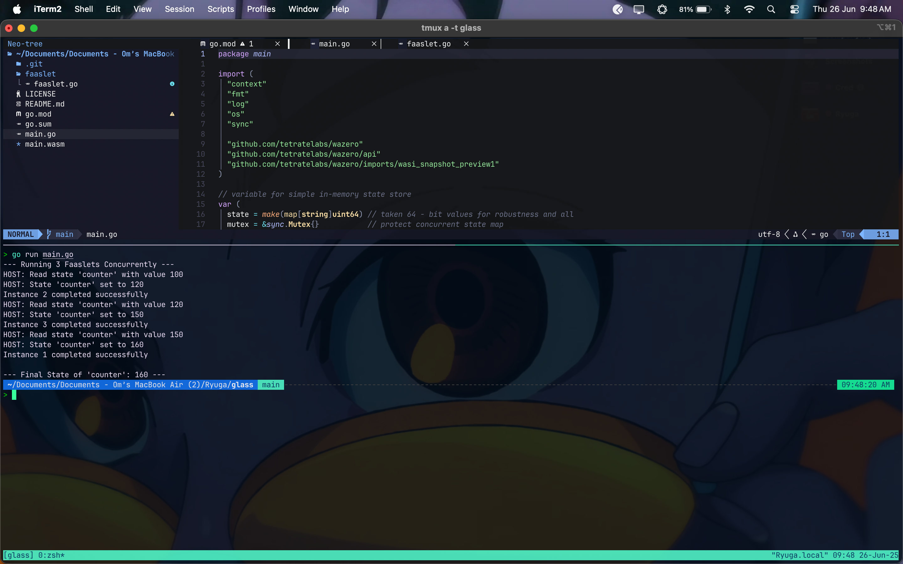

# Glass
Lightweight, shared-memory FaaS with WebAssembly in Go

## Why

Traditional serverless platforms face two critical performance bottlenecks:

### Data Access Overheads
- Functions often need to establish new database connections on every invocation
- Cold starts result in repeated authentication and connection setup overhead
- Network round-trips for simple state operations add significant latency
- Stateless nature forces expensive external calls for shared data

### Container Resource Footprint
- Each function instance requires its own container with full OS overhead
- Memory bloat from duplicate runtime environments and dependencies
- Slow startup times due to container initialization
- Resource waste when functions share similar execution contexts

## Solution

Glass addresses these issues through a shared-memory FaaS architecture:

**Shared State Management**: Functions share an in-memory state store, eliminating the need for repeated database connections and reducing data access latency to microseconds.

**WebAssembly Runtime**: WASM provides near-native performance with minimal overhead compared to containers, while maintaining strong isolation between function instances.

**Persistent Runtime**: The same runtime serves multiple function invocations, avoiding cold start penalties and connection setup costs.

**Memory Efficiency**: Multiple faaslets share the same host process memory space while remaining isolated through WASM's sandboxing.

## Features

- **WebAssembly Runtime**: Uses wazero for fast WASM execution
- **Shared State**: In-memory state management with Redis backend support
- **Concurrent Faaslets**: Multiple WASM instances running concurrently
- **HTTP API**: RESTful endpoints for function execution and state management
- **Load Balancer**: Consistent hashing load balancer for horizontal scaling
- **Session Affinity**: Routes requests based on user/session IDs for state locality
- **Health Monitoring**: Automatic health checking and failover
- **Modular Architecture**: Clean separation of concerns with separate packages

## Project Structure

```
.
├── main.go                 # Main application with embedded runtime
├── faaslet/               # WASM source code (TinyGo)
│   └── faaslet.go         # Exported functions for WASM
├── handlers/              # HTTP request handlers
│   └── handler.go         # Function invocation endpoints
├── runtime/               # WASM runtime management
│   └── runtime.go         # Wazero runtime wrapper
├── state/                 # State management
│   └── state.go           # Redis-backed state store
├── build.sh               # Build script for Go packages
├── build-wasm.sh          # TinyGo WASM compilation script
└── main.wasm              # Compiled WASM module
```

## Building

### Prerequisites

- Go 1.24.4+
- TinyGo (for WASM compilation)
- Redis (optional, for persistent state)

### Build Instructions

1. **Build the main application:**
   ```bash
   ./build.sh
   ```

2. **Rebuild WASM module (if needed):**
   ```bash
   ./build-wasm.sh
   ```

3. **Run the application:**
   ```bash
   ./glass
   ```

## Usage

### Single Node Mode

Run Glass in demo mode to see concurrent WASM execution:

```bash
./glass -mode=demo
```

Output:
```
--- Running 3 Faaslets Concurrently ---
HOST: Read state 'counter' with value 100
HOST: State 'counter' set to 120
Instance 2 completed successfully
...
--- Final State of 'counter': 160 ---
```

### HTTP Server Mode

Run Glass as an HTTP server:

```bash
./glass -mode=server -port=8080
```

Invoke functions via HTTP:

```bash
curl "http://localhost:8080/invoke/add?value=10"
curl "http://localhost:8080/invoke/multiply?value=5"
```

### Clustered Mode with Load Balancer

1. **Start a Glass cluster:**
   ```bash
   ./start-cluster.sh
   ```
   
   This will start:
   - 3 Glass instances on ports 9091, 9092, 9093
   - 1 Load balancer on port 8080

2. **Test the load balancer:**
   ```bash
   ./test-loadbalancer.sh
   ```

3. **Stop the cluster:**
   ```bash
   ./stop-cluster.sh
   ```

### Load Balancer Features

- **Consistent Hashing**: Routes requests based on routing keys for session affinity
- **Health Monitoring**: Automatic health checks every 10 seconds
- **Multiple Routing Strategies**:
  - User ID (`X-User-ID` header)
  - Session ID (`X-Session-ID` header or `session_id` cookie)
  - Function name (from URL path)
  - Client IP (fallback)
- **Virtual Nodes**: 150 virtual nodes per physical node for better distribution

### API Endpoints

**Glass Instance Endpoints:**
- `GET /invoke/{function}?value={number}` - Invoke a WASM function
- `GET /health` - Health check
- `GET /metrics` - Basic metrics

**Load Balancer Endpoints:**
- `GET /lb/health` - Load balancer health
- `GET /lb/status` - Detailed status with node information
- All other requests are proxied to Glass instances

## Demo


